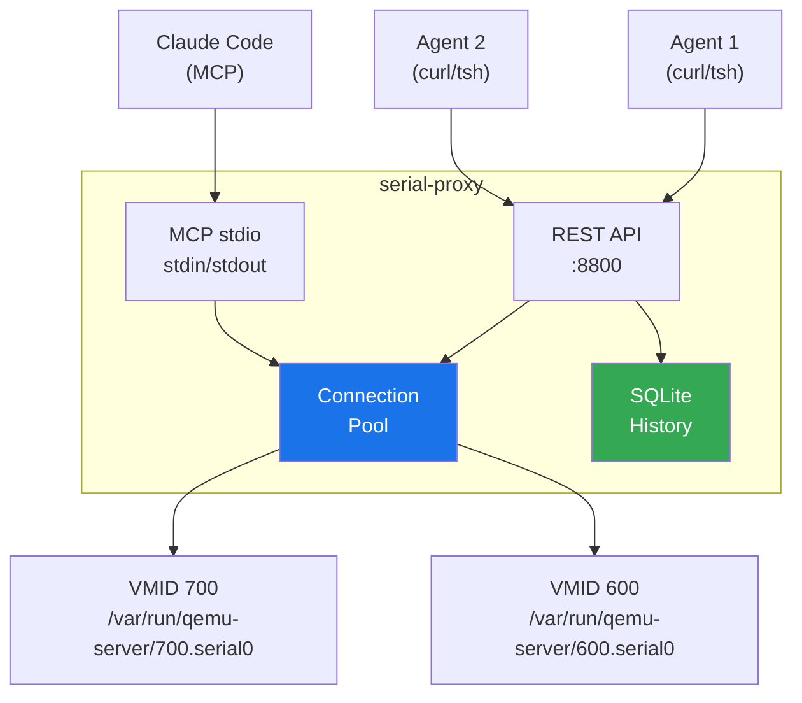

<p align="center">
  <strong>serial-proxy</strong><br>
  MCP + REST proxy for QEMU serial console sockets
</p>

<p align="center">
  
  
  
  <a href="https://github.com/ioplane/serial-proxy/blob/master/LICENSE"></a>
</p>

---

serial-proxy exposes QEMU serial console UNIX sockets on Proxmox VE as both an [MCP](https://modelcontextprotocol.io/) stdio server and an HTTP REST API. Multiple AI agents can concurrently send CLI commands to virtual machines (routers, firewalls, switches) and receive clean, structured JSON responses.

Built for lab automation and reverse engineering workflows where AI agents need programmatic access to network device consoles.

## Features

- **Dual transport**: MCP stdio (single client) + REST HTTP (multi-agent)
- **Connection pool**: persistent UNIX socket connections with automatic reconnect
- **Multi-agent**: `X-Agent-ID` header tracking, per-request IDs, timing
- **Structured logging**: JSON via `log/slog`, machine-readable in journald
- **Command history**: SQLite (WAL mode) with `/history` and `/stats` endpoints
- **Clean output**: strips ANSI escapes, `\r`, command echo, and trailing prompt
- **Zero dependencies**: single static binary, pure Go (including SQLite via modernc.org)
- **systemd ready**: hardened service unit included

## Quick Start

```bash
# Build (requires Podman, no local Go needed)
make build

# Deploy to Proxmox VE host
make deploy

# Or run directly
./serial-proxy --rest --vmid 700 --port 8800

# Execute a command
curl -s 'http://localhost:8800/exec?cmd=show+version&vmid=700&agent=my-agent'
```

## Architecture



## API Reference

### REST Endpoints

| Method | Path | Description |
|--------|------|-------------|
| `GET` | `/exec?cmd=...&vmid=...&wait=...&agent=...` | Execute CLI command |
| `POST` | `/exec` | Batch execute (JSON body) |
| `GET` | `/enable?vmid=...&password=...` | Enter enable/privileged mode |
| `GET` | `/status` | Connection pool status |
| `GET` | `/connect?vmid=...` | Connect to a new VM |
| `GET` | `/disconnect?vmid=...` | Disconnect from a VM |
| `GET` | `/history?agent=...&vmid=...&limit=50` | Command history |
| `GET` | `/stats` | Per-agent statistics |
| `GET` | `/health` | Health check |

### MCP Tools

| Tool | Description |
|------|-------------|
| `serial_exec` | Execute CLI command on a VM serial console |
| `serial_status` | Show connection status and available sockets |
| `serial_enable` | Enter privileged mode with password |
| `serial_raw` | Send raw data to serial console |

### Agent Tracking

Every request can carry an agent identifier:

```bash
# Via header
curl -H "X-Agent-ID: my-static-analyst" 'http://localhost:8800/exec?cmd=show+version'

# Via query parameter
curl 'http://localhost:8800/exec?cmd=show+version&agent=my-agent'

# In batch JSON body
curl -X POST http://localhost:8800/exec -d '{"agent":"batch-runner","vmid":700,"commands":["show version","show license"]}'
```

### Response Format

```json
{
  "vmid": 700,
  "cmd": "show version",
  "output": "Cisco Adaptive Security Appliance Software Version 9.24(1)\n...",
  "rid": "6b391544",
  "agent": "my-agent",
  "duration_s": 0.522
}
```

## Configuration

```
serial-proxy [flags]

Flags:
  --rest           Run in REST mode (default: MCP stdio)
  --debug          Enable debug logging (raw socket I/O)
  --port int       HTTP port, REST mode only (default 8800)
  --bind string    Bind address, REST mode only (default "127.0.0.1")
  --vmid int       VMID(s) to pre-connect, repeatable (default 700)
  --db string      SQLite history path (default "/var/lib/serial-proxy/history.db")
```

## Deployment

### systemd (Proxmox VE)

```bash
make deploy   # builds, copies binary + unit, enables service
```

Manual:

```bash
cp serial-proxy /usr/local/bin/
cp deployments/systemd/serial-proxy.service /etc/systemd/system/
mkdir -p /var/lib/serial-proxy
systemctl daemon-reload
systemctl enable --now serial-proxy
```

### Logs

```bash
# Structured JSON logs in journald
journalctl -u serial-proxy -f -o cat

# Filter by agent
journalctl -u serial-proxy -o cat | jq 'select(.agent == "my-agent")'
```

## Documentation

| # | English | Russian | Description |
|---|---------|---------|-------------|
| 01 | [Architecture](docs/en/01-architecture.md) | [Архитектура](docs/ru/01-architecture.md) | System design, data flow, concurrency model |
| 02 | [API Reference](docs/en/02-api-reference.md) | [API](docs/ru/02-api-reference.md) | REST + MCP endpoints, request/response schemas |
| 03 | [Deployment](docs/en/03-deployment.md) | [Развертывание](docs/ru/03-deployment.md) | systemd, Proxmox VE, security hardening |
| 04 | [Development](docs/en/04-development.md) | [Разработка](docs/ru/04-development.md) | Build, test, lint, contribute |

## License

Apache License 2.0. See [LICENSE](LICENSE).
