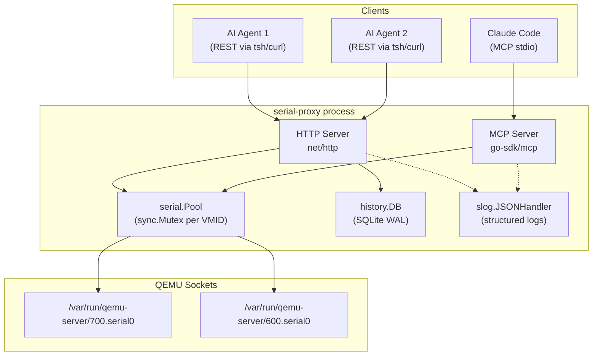

# Architecture

## Overview

serial-proxy is a lightweight Go service that bridges QEMU serial console UNIX sockets to structured JSON APIs. It supports two transports simultaneously: MCP stdio for single-client AI agent integration, and REST HTTP for multi-agent concurrent access.

## System Design



## Package Structure

```
cmd/serial-proxy/       Entry point, flag parsing, HTTP/MCP wiring
internal/serial/        Connection management (Conn, Pool)
internal/history/       SQLite command history (DB)
```

### internal/serial

- **Conn**: manages a single UNIX socket connection. All I/O is protected by `sync.Mutex` to serialize concurrent agent access to the same VM.
- **Pool**: maps VMID → Conn. Thread-safe via its own mutex. Lazy-connects on first access.

### internal/history

- **DB**: SQLite database with WAL journal mode. Write mutex ensures serialized inserts. Reads are lock-free (WAL). History writes are asynchronous (goroutine) to avoid blocking HTTP responses.

## Concurrency Model

```
Agent A (REST) ──┐
                  ├── Pool.Get(700) ──► Conn.mu.Lock() ──► socket write/read ──► Conn.mu.Unlock()
Agent B (REST) ──┘
                                         (serialized per VMID, parallel across VMIDs)

Agent C (MCP)  ──── Pool.Get(600) ──► Conn.mu.Lock() ──► socket write/read ──► Conn.mu.Unlock()
                                         (independent, no contention with 700)
```

- **Per-VMID serialization**: only one command executes at a time on a given serial socket. This is correct because serial consoles are inherently sequential.
- **Cross-VMID parallelism**: commands to different VMs execute concurrently with zero contention.
- **History writes**: fire-and-forget goroutines, serialized by the DB mutex.

## Data Flow

1. Agent sends `GET /exec?cmd=show+version&vmid=700&agent=analyst-1`
2. HTTP handler extracts parameters, generates request ID
3. `Pool.Get(700)` returns existing `Conn` or creates new one
4. `Conn.Exec()` acquires mutex, drains stale data, sends command, reads until prompt
5. Output cleaned: ANSI stripped, `\r` removed, echo/prompt stripped
6. Response returned as JSON with timing and agent ID
7. History recorded asynchronously in SQLite

## Error Handling

- **Connection loss**: automatic reconnect on write failure (one retry)
- **Socket not found**: 503 Service Unavailable with VMID in response
- **Timeout**: configurable `?wait=` parameter (default 3s), no hard timeout on the socket
- **History failure**: logged but never blocks the response path
