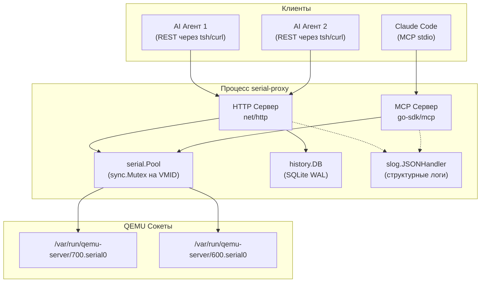

# Архитектура

## Обзор

serial-proxy — легковесный Go-сервис, который связывает UNIX-сокеты серийных консолей QEMU со структурированными JSON API. Поддерживает два транспорта одновременно: MCP stdio для интеграции с одним AI-агентом и REST HTTP для многоагентного параллельного доступа.

## Дизайн системы



## Структура пакетов

```
cmd/serial-proxy/       Точка входа, разбор флагов, HTTP/MCP маршрутизация
internal/serial/        Управление соединениями (Conn, Pool)
internal/history/       SQLite история команд (DB)
```

### internal/serial

- **Conn**: управляет одним UNIX-сокетом. Весь ввод/вывод защищен `sync.Mutex` для сериализации параллельного доступа агентов к одной ВМ.
- **Pool**: отображение VMID → Conn. Потокобезопасен благодаря собственному мьютексу. Ленивое подключение при первом обращении.

### internal/history

- **DB**: SQLite база данных в режиме WAL. Мьютекс записи гарантирует сериализацию вставок. Чтение свободно от блокировок (WAL). Записи истории асинхронны (горутина), чтобы не блокировать HTTP-ответы.

## Модель конкурентности

```
Агент A (REST) ──┐
                  ├── Pool.Get(700) ──► Conn.mu.Lock() ──► запись/чтение сокета ──► Conn.mu.Unlock()
Агент B (REST) ──┘
                                         (сериализация на уровне VMID, параллелизм между VMID)

Агент C (MCP)  ──── Pool.Get(600) ──► Conn.mu.Lock() ──► запись/чтение сокета ──► Conn.mu.Unlock()
                                         (независимо, нет конкуренции с 700)
```

- **Сериализация по VMID**: только одна команда выполняется в каждый момент времени на данном серийном сокете. Это корректно, так как серийные консоли по своей природе последовательны.
- **Параллелизм между VMID**: команды к разным ВМ выполняются параллельно без конкуренции.
- **Записи истории**: fire-and-forget горутины, сериализованные мьютексом БД.

## Поток данных

1. Агент отправляет `GET /exec?cmd=show+version&vmid=700&agent=analyst-1`
2. HTTP-обработчик извлекает параметры, генерирует ID запроса
3. `Pool.Get(700)` возвращает существующий `Conn` или создает новый
4. `Conn.Exec()` захватывает мьютекс, сбрасывает устаревшие данные, отправляет команду, читает до промпта
5. Вывод очищается: удаляются ANSI-коды, `\r`, эхо команды и промпт
6. Ответ возвращается в JSON с таймингом и ID агента
7. История записывается асинхронно в SQLite

## Обработка ошибок

- **Потеря соединения**: автоматическое переподключение при ошибке записи (одна попытка)
- **Сокет не найден**: 503 Service Unavailable с VMID в ответе
- **Таймаут**: настраиваемый параметр `?wait=` (по умолчанию 3с)
- **Ошибка истории**: логируется, но никогда не блокирует ответ
